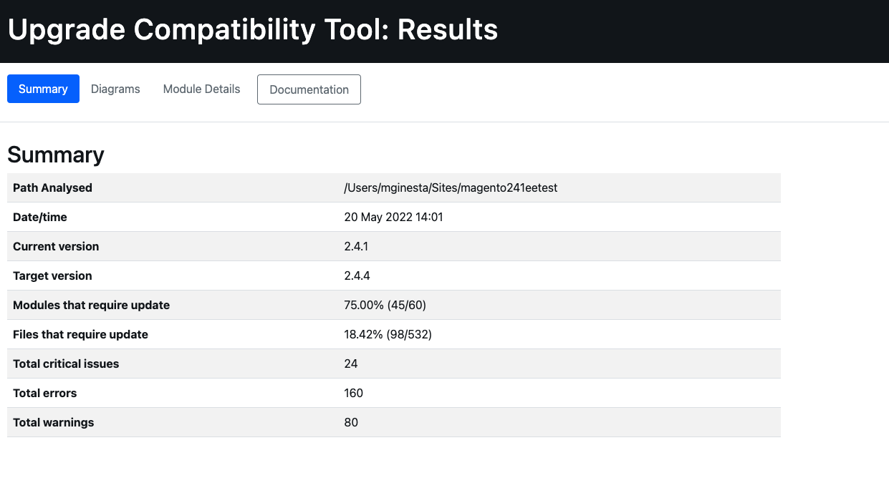

# Kör [!DNL Upgrade Compatibility Tool]

The [!DNL Upgrade Compatibility Tool] är ett kommandoradsverktyg som kontrollerar en Adobe Commerce-anpassad instans mot en viss version genom att analysera alla installerade moduler. Den returnerar en lista med allvarliga problem, fel och varningar som måste åtgärdas innan du uppgraderar till den senaste versionen av Adobe Commerce.

The [!DNL Upgrade Compatibility Tool] identifierar möjliga problem som måste åtgärdas i koden innan du försöker uppgradera till en nyare version av Adobe Commerce.

## Använd `upgrade:check` kommando

The `upgrade:check` är det huvudsakliga kommandot som kör verktyget:

```bash
bin/uct upgrade:check <dir>
```

>[!TIP]
>
>The `<dir>` värde är den katalog där din Adobe Commerce-instans finns.

The `upgrade:check` kommandot kör [!DNL Upgrade Compatibility Tool] och kontrollerar en Adobe Commerce-anpassad instans mot en viss version genom att analysera alla moduler som är installerade i den. Den returnerar en lista med viktiga problem, fel och varningar som måste åtgärdas innan du uppgraderar till den senaste versionen av din Adobe Commerce.

>[!WARNING]
>
>Kör bara när projektets rotkatalog (eller huvudkatalogen) anges.

Det här kommandot kontrollerar om det finns några kodändringar för den specifika Adobe Commerce-instansen och om alla anpassade kodändringar har installerats i den.

Du kan köra `core:code:changes` om du bara vill analysera kodändringar för den specifika Adobe Commerce-instansen. Se [Huvudkodändringar](../upgrade-compatibility-tool/run.md#use-the-core:code:changes-command) -avsnitt.

Du kan använda `graphql:compare` om du vill jämföra två GraphQL-scheman för att kontrollera om det finns några ändringar mellan dem. Se [Verifiering av GraphQL-schemakompatibilitet](../upgrade-compatibility-tool/run.md#graphql-schema-compatibility-verification) -avsnitt.

### Recommendations använder `upgrade:check` kommando

- The [!DNL Upgrade Compatibility Tool] kräver minst 2 GB RAM-minne för att köras. Den här inställningen rekommenderas för att undvika problem på grund av en låg minnesbegränsning. The [!DNL Upgrade Compatibility Tool] visar en fråga om du kör `upgrade:check` kommando med låg `memory_limit` inställning.
- Ange `-m` för att köra verktyget mot en specifik modul:

   ```bash
   bin/uct upgrade:check <dir> -m[=MODULE-PATH]
   ```

Där argumenten är följande:

- `<dir>`: Adobe Commerce installationskatalog.
- `[=MODULE-PATH]`: En specifik modulsökvägskatalog.

### Använd `--help` option

Om du vill se [!DNL Upgrade Compatibility Tool] allmänna kommandoalternativ och hjälp, kör:

```bash
bin/uct --help
```

Det går dock att köra `--help` som ett alternativ när du kör ett specifikt kommando, som `bin/uct upgrade:check`. Detta returnerar specifika `--help` alternativ för det kommandot:

```bash
bin/uct upgrade:check --help
```

Tillgänglig `--help` för `upgrade:check` kommando:

- `-m, --module-path[=MODULE-PATH]`: Sökväg till de moduler som ska analyseras
- `-a, --current-version[=CURRENT-VERSION]`: Aktuell Adobe Commerce-version, version av Adobe Commerce-installationen, används om den utelämnas.
- `-c, --coming-version[=COMING-VERSION]`: Adobe Commerce-målversion, version av Adobe Commerce-installationen, används om den utelämnas.
- `--json-output-path[=JSON-OUTPUT-PATH]`: Sökväg till filen där utdata ska exporteras i json-format.
- `--html-output-path[=HTML-OUTPUT-PATH]`: Sökväg till filen där utdata ska exporteras i HTML-format.
- `--min-issue-level`: Minsta utgivningsnivå som ska visas i rapporten. Standard är [VARNING].
- `--ignore-current-version-compatibility-issues`: Använd det här alternativet om du inte vill inkludera kända allvarliga problem, fel och varningar i [!DNL Upgrade Compatibility Tool] rapport.
- `--context=CONTEXT`: Körningskontext. Det här alternativet är avsett för integrering och påverkar inte körningsresultatet.
- `-h, --help`: Visa hjälp för det specifika kommandot. Om inget kommando anges `list` är standardresultatet.
- `-q, --quiet`: Skriv inga meddelanden när kommandot körs.
- `-v, --version`: Visa programversion.
- `--ansi, --no-ansi`: Aktivera ANSI-utdata.
- `-n, --no-interaction`: Ställ inga interaktiva frågor när du kör kommandot.
- `-v, --vv, --vvv, --verbose`: Öka detaljrikedomen i utdatakommunikationen. 1 för normal utskrift, 2 för utförlig utskrift och 3 för DEBUG-utdata.

### Utdata

Som ett resultat av den analys som gjorts [!DNL Upgrade Compatibility Tool] exporterar en rapport som innehåller en lista med problem för varje fil och anger hur allvarlig den är, felkoden och felbeskrivningen.

Se exemplet nedan:

```terminal
File: /app/code/Custom/CatalogExtension/Controller/Index/Index.php
------------------------------------------------------------------
 * [WARNING][1131] Line 23: Extending from class 'Magento\Framework\App\Action\Action' that is @deprecated on version '2.4.2'
 * [ERROR][1429] Line 103: Call method 'Magento\Framework\Api\SearchCriteriaBuilder::addFilters' that is non API on version '2.4.2'
 * [CRITICAL][1110] Line 60: Instantiating class/interface 'Magento\Catalog\Model\ProductRepository' that does not exist on version '2.4.2'
```

Kontrollera [Felmeddelandereferens](error-messages.md) för mer information.

Rapporten innehåller även en detaljerad sammanfattning som visar:

- *Aktuell version*: den version som är installerad.
- *Målversion*: den version du vill uppgradera till.
- *Körningstid*: hur lång tid det tog att sammanställa rapporten (mm:ss).
- *Moduler som behöver uppdateras*: procentandelen moduler som innehåller kompatibilitetsproblem och som behöver uppdateras.
- *Filer som behöver uppdateras*: procentandelen filer som innehåller kompatibilitetsproblem och som behöver uppdateras.
- *Totalt antal kritiska fel*: antalet kritiska fel som påträffats.
- *Totalt antal fel*: antalet fel som hittats.
- *Totalt antal varningar*: antalet varningar som hittats.

Se exemplet nedan:

```terminal
 ----------------------------- ------------------
  Current version               2.4.2
  Target version                2.4.3
  Execution time                1m:10s
  Modules that require update   78.33% (47/60)
  Files that require update     21.62% (115/532)
  Total critical issues         35
  Total errors                  201
  Total warnings                103
 ----------------------------- ------------------
```

>[!NOTE]
>
>Som standard är [!DNL Upgrade Compatibility Tool] exporterar rapporten till två olika format: `json` och `html`.

#### JSON

JSON-filen innehåller exakt samma information som visas för utdata:

- Lista över identifierade problem.
- Sammanfattning av analysen.

För varje påträffat fel innehåller rapporten detaljerad information som problemets svårighetsgrad och beskrivning.

>[!NOTE]
>
>Standardsökvägen för utdatamappen är `var/output/[TIME]-results.json`.

Om du vill exportera den här rapporten till en annan utdatamapp kör du:

```bash
bin/uct upgrade:check <dir> --json-output-path[=JSON-OUTPUT-PATH]
```

Där argumenten är följande:

- `<dir>`: Adobe Commerce installationskatalog.
- `[=JSON-OUTPUT-PATH]`: Sökvägskatalog som ska exporteras `.json` utdatafil.

>[!NOTE]
>
>Standardsökvägen för utdatamappen är `var/output/[TIME]-results.json`.

#### HTML

Filen HTML innehåller även en lista över identifierade problem och en analyssammanfattning. Den innehåller även fyra olika diagram:

- **Moduler efter allvarlighetsgrad för problem**: Visar allvarlighetsgrad fördelad efter moduler.
- **Filer efter allvarlighetsgrad för problem**: Visar allvarlighetsgrad för fildistribution.
- **Moduler ordnade efter totalt antal utgåvor**: Visar de 10 mest komprometterade modulerna med hänsyn till varningar, fel och kritiska fel.
- **Moduler med relativa storlekar och problem**: Ju fler filer en modul innehåller, desto större blir cirkeln. Ju fler problem en modul har, desto mer röd blir cirkeln.

Med hjälp av dessa diagram kan du snabbt identifiera de delar som är mest komprometterade och de som kräver mer arbete för en uppgradering.




Om du vill exportera den här rapporten till en annan utdatamapp kör du:

```bash
bin/uct upgrade:check <dir> --html-output-path[=HTML-OUTPUT-PATH]
```

Där argumenten är följande:

- `<dir>`: Installationskatalogen för {{site.data.var.ee}}.
- `[=HTML-OUTPUT-PATH]`: Sökvägskatalog som ska exporteras `.html` utdatafil.

>[!NOTE]
>
>Standardsökvägen för utdatamappen är `var/output/[TIME]-results.html`.

### Använd `--ignore-current-version-compatibility-issues` option

The [!DNL Upgrade Compatibility Tool] låter dig köra `upgrade:check` kommando med `--ignore-current-version-compatibility-issues` så att endast nya eller okända allvarliga problem, fel och varningar visas. Använd det här alternativet om du inte vill inkludera kända allvarliga problem, fel och varningar i [!DNL Upgrade Compatibility Tool] rapport.

```bash
bin/uct upgrade:check --ignore-current-version-compatibility-issues <dir>
```

>[!NOTE]
>
>Detta gäller endast för PHP API-valideringar.

### Vanilla-installation

A _vanilj_ installation är en ren installation av en angiven versionstagg eller gren för en specifik version.

The `bin/uct core:code:changes` -kommandot kontrollerar om det finns en vanilj-instans i systemet. Om det här är första gången du använder en vanilj-installation uppmanas du att hämta vanilj-projektet från [Adobe Commerce](https://repo.magento.com/).

Du kan köra en [!DNL Upgrade Compatibility Tool] med `--vanilla-dir` om du vill ange installationskatalogen för Adobe Commerce vanilla.

Se [Distribuera vanilj-instans](https://devdocs.magento.com/contributor-guide/contributing.html#vanilla-pr) för mer information.

## Använd `list` kommando

Returnera en lista med [!DNL Upgrade Compatibility Tool] tillgängliga kommandon, kör:

```bash
bin/uct list
```

The `list` returnerar följande:

- `-h, --help`: Visa hjälp för det specifika kommandot. Om inget kommando anges `list` är standardresultatet.
- `-q, --quiet`: Skriv inga meddelanden när kommandot körs.
- `-v, --version`: Visa appversion.
- `--ansi, --no-ansi`: Aktivera ANSI-utdata.
- `-n, --no-interaction`: Ställ inga interaktiva frågor när du kör kommandot.
- `-v, --vv, --vvv, --verbose`: Öka detaljrikedomen i utdatakommunikationen. 1 för normal utskrift, 2 för utförlig utskrift och 3 för DEBUG-utdata.

## Använd `core:code:changes` kommando

Du kan jämföra din nuvarande Adobe Commerce-installation med en ren vanilj-installation för att se om kärnkoden innehåller några ändringar som gjorts för att implementera en ny funktion eller anpassning. Valideringen hjälper till att uppskatta den insats som uppgraderingen kräver baserat på dessa ändringar.

```bash
bin/uct core:code:changes <dir> <vanilla dir>
```

Där argumenten är följande:

- `<dir>`: Adobe Commerce installationskatalog.
- `<vanilla dir>`: Installationskatalogen för Adobe Commerce vanilla.

Det finns vissa begränsningar när du kör det här kommandot:

- Kör bara när projektets rotkatalog (eller huvudkatalogen) anges.
- Visar endast en lista med kärnändringar.

### Använd `core:code:changes` med `--help` option

Tillgänglig `--help` för `core:code:changes` kommando:

- `-h, --help`: Visa hjälp för det specifika kommandot. Om inget kommando anges `list` är standardresultatet.
- `-q, --quiet`: Skriv inga meddelanden när kommandot körs.
- `-v, --version`: Visa appversion.
- `--ansi, --no-ansi`: Aktivera ANSI-utdata.
- `-n, --no-interaction`: Ställ inga interaktiva frågor när du kör kommandot.
- `-v, --vv, --vvv, --verbose`: Öka detaljrikedomen i utdatakommunikationen. 1 för normal utskrift, 2 för utförlig utskrift och 3 för DEBUG-utdata.

## Version

Du kan jämföra din nuvarande Adobe Commerce-installation med Adobe Commerce-versioner `>=2.3`.

Du måste ange versionen som en parameter när du kör kommandot:

```bash
bin/uct upgrade:check <dir> -c 2.4.3
```

Var:

- `-c, --coming-version[=COMING-VERSION]`: Målversionen för Adobe Commerce.

Det finns vissa begränsningar när du kör föregående kommando:

- Den här parametern refererar till taggar som identifierar en viss version av Adobe Commerce.
- Det är ett krav att uttryckligen ange detta. om bara värdet inte fungerar.
- Ange taggversionen utan citattecken (varken enkla eller dubbla): ~~&quot;2.4.1-develop&quot;~~.
- Du bör INTE tillhandahålla äldre versioner än den som du har installerat, eller äldre än 2.3, som för närvarande är den äldsta som stöds.

## Verifiering av GraphQL-schemakompatibilitet

The [!DNL Upgrade Compatibility Tool] ger även möjlighet att granska två GraphQL-slutpunkter och jämföra deras scheman för att hitta brytningar och farliga förändringar mellan dem:

```bash
bin/uct graphql:compare <schema1> <schema2>
```

Där argumenten är följande:

- `<schema1>`: Slutpunkts-URL för den befintliga installationen.
- `<schema2>`: Slutpunkts-URL för vanilj-installationen.

Du måste köra `instance before` och `instance after` uppgraderingen.

### Jämförelsekommando för GraphQL `--help` alternativ

Tillgänglig `--help` för `graphql:compare` kommando:

- `-h, --help`: Visa hjälp för det specifika kommandot. Om inget kommando anges `list` är standardresultatet.
- `-q, --quiet`: Skriv inga meddelanden när kommandot körs.
- `-v, --version`: Visa appversion.
- `--ansi, --no-ansi`: Aktivera ANSI-utdata.
- `-n, --no-interaction`: Ställ inga interaktiva frågor när du kör kommandot.
- `-v, --vv, --vvv, --verbose`: Öka detaljrikedomen i utdatakommunikationen. 1 för normal utskrift, 2 för utförlig utskrift och 3 för DEBUG-utdata.

### Exempel med en lista med kritiska problem, fel och varningar för GraphQL

```terminal
 *   [WARNING] FIELD_CHANGED_KIND: ConfigurableProduct.gender changed type from Int to String.
 *   [WARNING] OPTIONAL_INPUT_FIELD_ADDED: An optional field sku on input type ProductAttributeSortInput was added.
```

Se [Utvecklarinformation](../upgrade-compatibility-tool/developer.md) för mer information.

Du kan köra [!DNL Upgrade Compatibility Tool] med en körningskonfiguration via plugin-programmet PhpStorm. Se [[!DNL Upgrade Compatibility Tool] Kör konfiguration](https://devdocs.magento.com/guides/v2.3/ext-best-practices/phpstorm/uct-run-configuration.html) för mer information.

## Felsökning

### Tomma utdata

>[!NOTE]
>
>The `M2_VERSION` är den målversion av Adobe Commerce som du vill jämföra med din Adobe Commerce-instans.

Om du har kört det här kommandot:

```bash
bin/uct upgrade:check INSTALLATION_DIR -c M2_VERSION
```

Det enda resultatet är `Upgrade compatibility tool`:

```terminal
bin/uct upgrade:check /var/www/project/magento/ -c 2.4.1
Upgrade compatibility tool
```

Den troliga orsaken är en minnesbegränsning för PHP.
Åsidosätt minnesbegränsningen genom att ange `memory_limit` till `-1`:

```bash
php -d memory_limit=-1 /bin/uct upgrade:check INSTALLATION_DIR -c M2_VERSION
```
